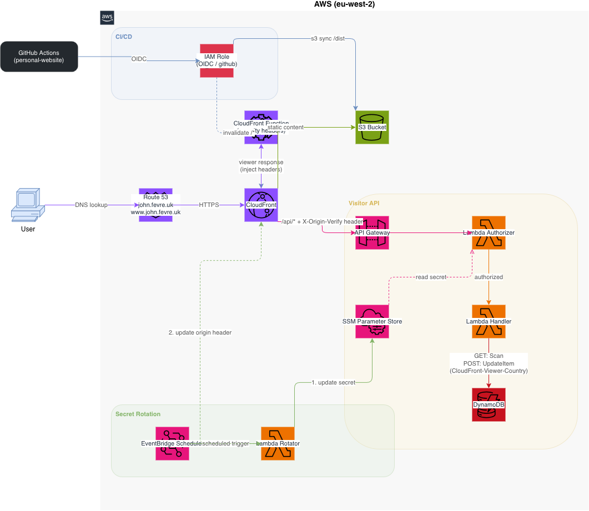

# Portfolio

Personal CV/portfolio website built with [Astro](https://astro.build). Inspired by [brittanychiang.com](https://brittanychiang.com).


---

## Architecture

<picture>
  <source media="(prefers-color-scheme: dark)" srcset="public/architecture-dark.drawio.png">
  <source media="(prefers-color-scheme: light)" srcset="public/architecture-light.drawio.png">
  
</picture>

> Source: [`architecture.drawio`](architecture.drawio) — open with [draw.io](https://app.diagrams.net) or the [VS Code extension](https://marketplace.visualstudio.com/items?itemName=hediet.vscode-drawio).

The site is a static Astro build served via CloudFront + S3. A separate visitor-tracking API runs behind the same CloudFront distribution using API Gateway, Lambda, and DynamoDB — secured by a rotating shared secret.

### Request Flow

| Path | Route |
|------|-------|
| `/*` | CloudFront → S3 (static assets) |
| `/api/visitors` | CloudFront → API Gateway → Lambda (authorizer + handler) → DynamoDB |

1. **Authorizer** — Lambda validates the `X-Origin-Verify` header against a secret stored in SSM Parameter Store. Requests without a valid header are rejected before reaching the handler.
2. **Handler** — Lambda queries DynamoDB and returns country-level visitor statistics.

### Secret Rotation

A scheduled EventBridge trigger invokes a rotation Lambda that:

1. Generates a new secret
2. Updates SSM Parameter Store
3. Updates the CloudFront origin custom header

### CI/CD

Push to `main` → GitHub Actions authenticates via OIDC (no long-lived credentials) → builds the Astro site → syncs `/dist` to S3 → invalidates the CloudFront cache.

---

## Stack

| Concern | Tool |
|---------|------|
| Framework | [Astro](https://astro.build) (static output) |
| Styling | CSS custom properties |
| Mapping | [Leaflet](https://leafletjs.com) |
| Hosting | AWS S3 + CloudFront |
| API | API Gateway + Lambda + DynamoDB |
| Infrastructure | Terragrunt / OpenTofu |
| CI/CD | GitHub Actions (OIDC) |

---

## Quick Start

```bash
npm install
npm run dev      # http://localhost:4321
npm run build    # outputs to /dist
npm run preview  # preview the build
```

---

## Project Structure

```
src/
  components/
    layout/       # Nav, Sidebar, Footer
    sections/     # Hero, About, Experience, Projects, Contact, Visitors
    ui/           # Reusable components
  content/        # JSON data files — edit these, not the components
    meta.json     # Name, role, bio, social links
    jobs.json     # Work experience
    projects.json # Projects
  styles/
    global.css    # Design tokens and base styles
  pages/
    index.astro   # Single-page layout
public/
  resume.pdf         # Downloadable CV
  countries.geojson  # Country boundaries for visitor map
```

**To update content**, edit the JSON files in `src/content/` — never modify components directly.

---

## License

[MIT](LICENSE)
